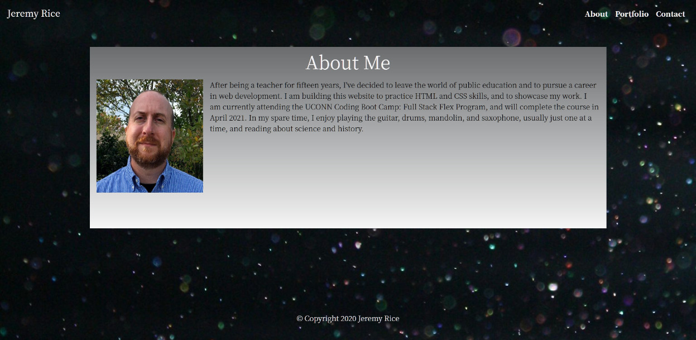
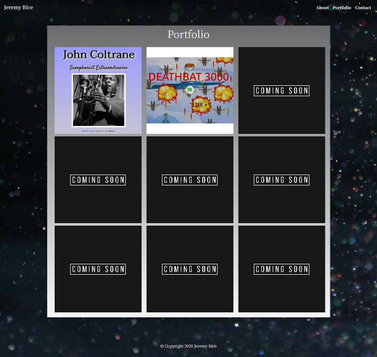
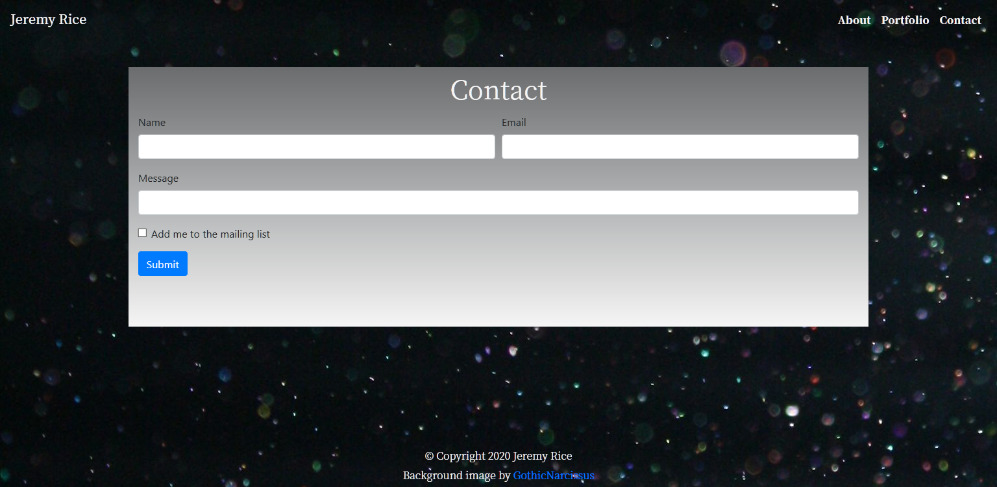

## Responsive Portfolio
A collection of my professional coding projects, as well as some background and contact information about me. 

## Description 

Personal website/contact page/portfolio with Bootstrap and Responsive Design.

[Link to published website](https://jdavidrice.github.io/Responsive_Portfolio/index.html)

## Table of Contents

* [Description](#Description)
* [Table of Contents](#Table-of-Contents)
* [Photos](#Photos)
* [Installation](#Installation)
* [Usage](#Usage)
* [Credits](#Credits)
* [License](#License)
* [Contributing](#Contributing)

## Photos

* [Return to Top](#Responsive-Portfolio)

## Installation
 
 There is nothing to install to view the contents of this website. 

* [Return to Top](#Responsive-Portfolio)

## Usage 
 
 Read the content of the website to learn about Jeremy Rice. Links on the "Portfolio" page are live and will bring you to the specified website. 

* [Return to Top](#Responsive-Portfolio)

## Credits

The "Coming Soon" graphic is from [Vectorstock.com](https://www.vectorstock.com/royalty-free-vector/coming-soon-template-design-vector-33644926).
* [Return to Top](#Responsive-Portfolio)

## License

MIT License

Copyright (c) 2021 Jeremy Rice

Permission is hereby granted, free of charge, to any person obtaining a copy
of this software and associated documentation files (the "Software"), to deal
in the Software without restriction, including without limitation the rights
to use, copy, modify, merge, publish, distribute, sublicense, and/or sell
copies of the Software, and to permit persons to whom the Software is
furnished to do so, subject to the following conditions:

The above copyright notice and this permission notice shall be included in all
copies or substantial portions of the Software.

THE SOFTWARE IS PROVIDED "AS IS", WITHOUT WARRANTY OF ANY KIND, EXPRESS OR
IMPLIED, INCLUDING BUT NOT LIMITED TO THE WARRANTIES OF MERCHANTABILITY,
FITNESS FOR A PARTICULAR PURPOSE AND NONINFRINGEMENT. IN NO EVENT SHALL THE
AUTHORS OR COPYRIGHT HOLDERS BE LIABLE FOR ANY CLAIM, DAMAGES OR OTHER
LIABILITY, WHETHER IN AN ACTION OF CONTRACT, TORT OR OTHERWISE, ARISING FROM,
OUT OF OR IN CONNECTION WITH THE SOFTWARE OR THE USE OR OTHER DEALINGS IN THE
SOFTWARE.

* [Return to Top](#Responsive-Portfolio)

## Contributing

Jeremy Rice

* [Return to Top](#Responsive-Portfolio)

